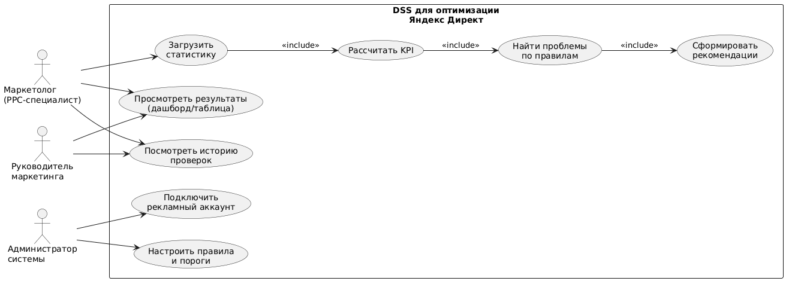

# Лабораторная работа №1  
## Тема: Формулирование требований к программной системе  
### Цель работы
Научиться анализировать поставленную задачу, формулировать функциональные и нефункциональные требования к проектируемой системе.

---

## Перечень заинтересованных лиц (стейкхолдеров)

1. **Маркетолог / PPC-специалист**  
   Основной пользователь системы. Анализирует показатели рекламных кампаний, получает рекомендации, принимает решения по оптимизации.

2. **Руководитель маркетинга / Team Lead**  
   Контролирует эффективность рекламных активностей, интересуется сводными отчетами и динамикой KPI, использует систему для контроля качества работы.

3. **Владелец бизнеса / заказчик (в случае агентства — клиент)**  
   Заинтересован в достижении бизнес-результатов (лиды/продажи) при заданном бюджете и приемлемом CPA. Получает прозрачные отчеты и понимание, где расходуется бюджет.

4. **Администратор системы**  
   Настраивает доступы, подключает рекламные аккаунты, управляет параметрами правил, отвечает за техническую поддержку.

5. **Инженер/разработчик**  
   Обслуживает систему, следит за логами, обновлениями, стабильностью интеграций с API.

---

## Перечень функциональных требований

Ниже требования сформулированы с ориентацией на стейкхолдеров.

### FR-1. Подключение рекламного аккаунта
- Система должна позволять администратору подключить рекламный аккаунт Яндекс Директ (через токен/авторизацию).
- Доступ к подключению должен быть ограничен ролью администратора.

### FR-2. Загрузка статистики
- Система должна загружать статистику по кампаниям за выбранный период (день/неделя/месяц).
- Пользователь должен уметь выбирать период и фильтры (например, конкретные кампании).

### FR-3. Расчет KPI
- Система должна рассчитывать и отображать основные показатели эффективности:
  показы, клики, расход, CTR, CPC, а также конверсии и CPA при наличии данных.

### FR-4. Выявление проблемных ситуаций по правилам
- Система должна автоматически находить элементы, требующие внимания, по набору правил (например: высокий расход без конверсий, низкий CTR, рост CPC/CPA, ухудшение динамики).

### FR-5. Генерация рекомендаций
- Система должна формировать рекомендации в понятном виде, привязанные к проблеме (что проверить и какие элементы требуют внимания).

### FR-6. Просмотр результатов
- Система должна предоставлять интерфейс просмотра результатов анализа:
  список кампаний/элементов с KPI, проблемами и рекомендациями.
- Пользователь должен иметь возможность сортировать и фильтровать результаты.

### FR-7. История проверок
- Система должна сохранять историю запусков анализа (дата/период/результаты), чтобы пользователь мог сравнивать изменения.

### FR-8. Управление правилами
- Администратор должен иметь возможность включать/выключать правила и задавать пороговые значения (минимальный набор для MVP).

---

## Диаграмма вариантов использования

Ниже приведена use case diagram

 

---

## Перечень сделанных предположений

1. **Доступ к API возможен и легален для используемого аккаунта.**
   Предполагается, что рекламный аккаунт имеет право работать с API и ограничения/лимиты не блокируют разработку MVP.

2. **Конверсии/CPA доступны не всегда.**
   Если цели/конверсии не настроены или данные не передаются, система работает в режиме анализа по кликам/расходам/CTR/CPC.

3. **Рекомендации формируются на основе прозрачных правил.**
   В MVP рекомендации не являются “самообучающимися” и не требуют сложных ML-моделей, чтобы обеспечить объяснимость.

4. **Пороговые значения KPI задаются вручную.**
   Например, “CTR ниже 1%” или “расход > X при 0 конверсий” — задается администратором/маркетологом.

5. **Один пользователь может управлять несколькими аккаунтами.**
   Для MVP допускается поддержка нескольких подключений, но это не обязательное условие первой версии.

6. **Интерфейс может быть простым.**
   Для MVP допускается минимальный веб-интерфейс (таблица + фильтры) без сложной визуализации.

---

## Перечень нефункциональных требований

1. **Безопасность доступа и данных**

   * Токены/ключи должны храниться безопасно (например, в переменных окружения/секретах).
   * Доступ к функциям подключения аккаунта и настройке правил должен быть ограничен ролью администратора.

2. **Объяснимость**

   * Каждая рекомендация должна сопровождаться причиной (какое правило сработало и какие KPI это подтвердили).
   * В MVP запрещены “непонятные” выводы без объяснения.

3. **Надежность и устойчивость к ошибкам интеграции**

   * Ошибки запросов к API должны логироваться.
   * При временных сбоях должна быть возможность повторного запуска анализа без потери данных.

4. **Производительность на типовом объеме данных**

   * Система должна обрабатывать статистику в разумное время для аккаунта с сотнями/тысячами элементов (кампании/группы/объявления).
   * Для MVP достаточно обработки на уровне кампаний и агрегированных показателей.

5. **Расширяемость правил анализа**

   * Архитектура должна позволять добавлять новые правила (например, новые проверки KPI) без переписывания всего модуля анализа.
