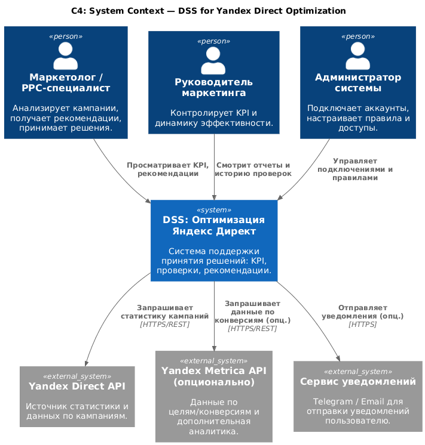
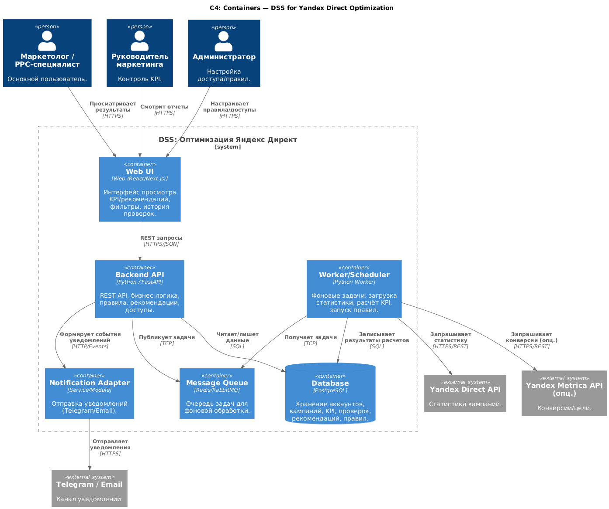
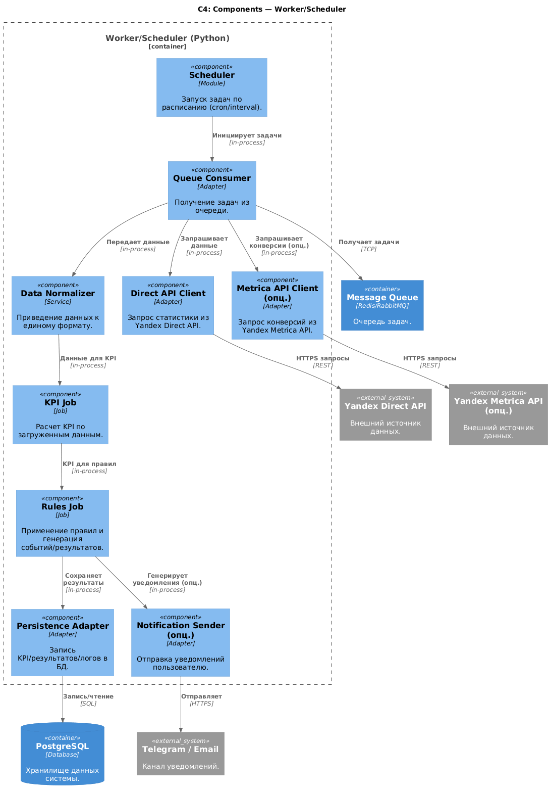

# Лабораторная работа №2  
## Тема: Использование нотации C4 model для проектирования архитектуры программной системы  
### Цель работы
Получить опыт использования графической нотации для фиксации архитектурных решений.

---

## Диаграмма системного контекста

 
На диаграмме показано, что система DSS для оптимизации Яндекс Директ используется маркетологами и руководителем маркетинга для анализа кампаний и рекомендаций. Система получает данные из внешних систем (Yandex Direct API, опционально Yandex Metrica API) и может отправлять уведомления пользователям (например, в Telegram/Email).  

Ключевые элементы:
- Пользователи: Маркетолог, Руководитель маркетинга, Администратор.
- Целевая система: DSS (Decision Support System).
- Внешние системы: Yandex Direct API, Yandex Metrica API, Notification Service.

---

## Диаграмма контейнеров

Выбран базовый архитектурный стиль: **клиент–сервер + сервисная архитектура с асинхронной обработкой**.  

Причины выбора:
1) Нужно **несколько модулей развертывания** и **сетевое взаимодействие**: Web UI ↔ Backend API ↔ DB, а также отдельный Worker через очередь.  
2) Интеграции с внешними API (Яндекс) лучше выполнять в отдельном воркере по расписанию, чтобы не блокировать UI.  
3) Простота MVP: можно начинать без сложной микросервисности, но уже иметь разделение на контейнеры.

Контейнеры:
- **Web UI** — фронтенд для просмотра KPI/рекомендаций.
- **Backend API** — бизнес-логика, пользователи, правила, выдача результатов.
- **Database (PostgreSQL)** — хранение кампаний, KPI, проверок, рекомендаций.
- **Worker/Scheduler** — фоновые задачи: загрузка статистики, расчет KPI, запуск правил.
- **Message Queue (Redis/RabbitMQ)** — очередь задач между Backend и Worker.
- **Notification Adapter** — отправка уведомлений (Telegram/Email) как отдельный модуль.

---

## Диаграмма компонентов

### Компоненты контейнера Backend API

Показано разбиение Backend на компоненты:
- Auth & RBAC
- Account Integration (подключение аккаунта/токенов)
- Campaign Data Service (работа с данными кампаний)
- KPI Calculator (расчет метрик)
- Rules Engine (проверки и правила)
- Recommendations Service (формирование рекомендаций)
- Reporting API (выдача данных на UI)
- Repositories (доступ к БД)
- Queue Client (постановка задач воркеру)

### Компоненты контейнера Worker/Scheduler

Показано, как Worker выполняет:
- Scheduler (cron/планировщик)
- Direct API Client
- Metrica API Client (опционально)
- Data Normalizer (приведение данных к единому формату)
- KPI Job / Rules Job (пайплайн обработки)
- Persistence Adapter (запись результатов в БД)
- Notification Sender (опционально)

---