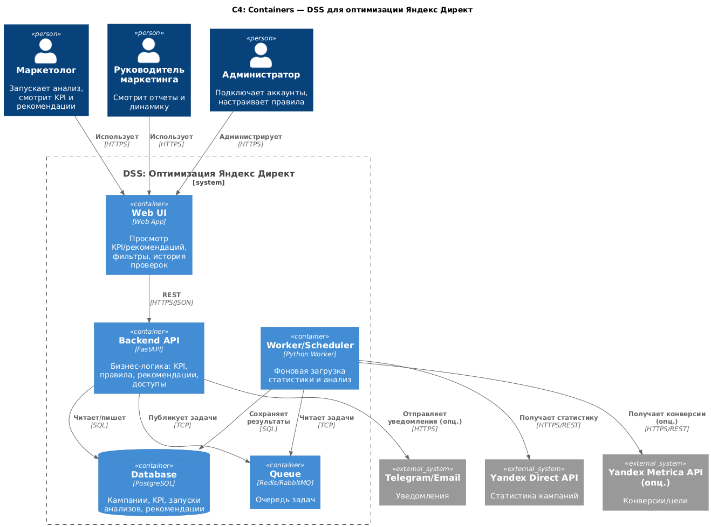
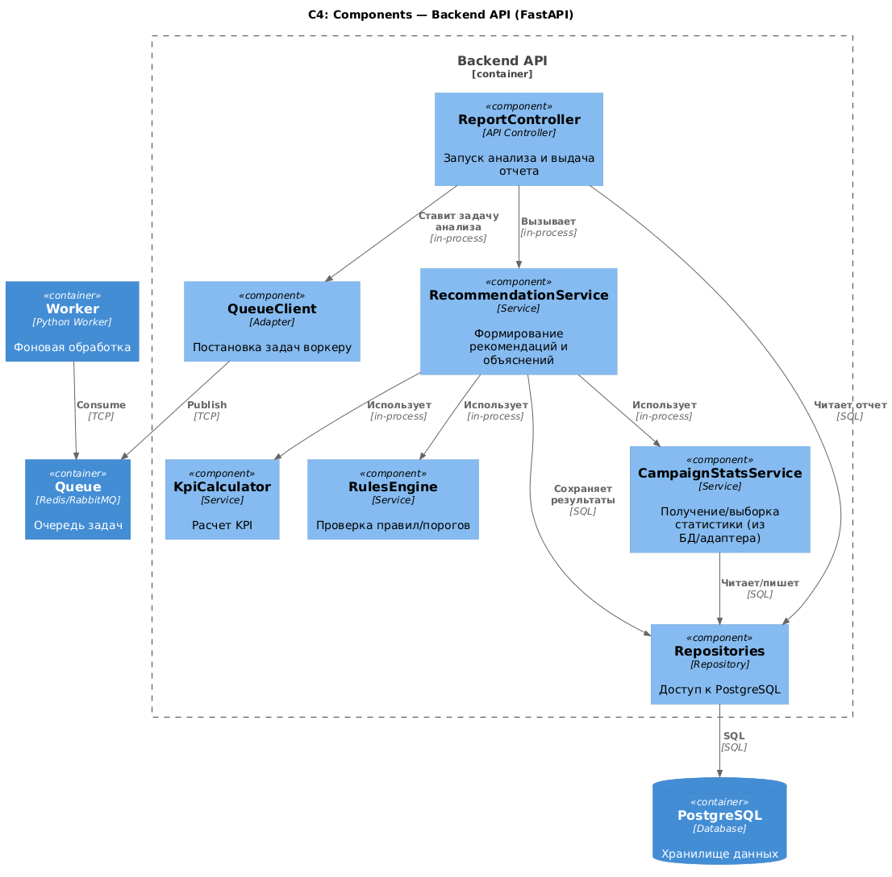
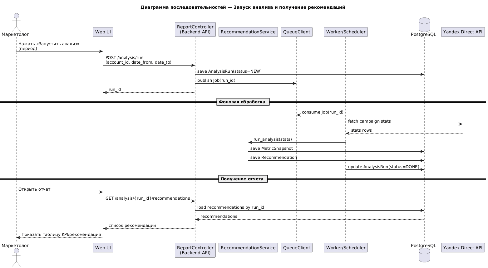
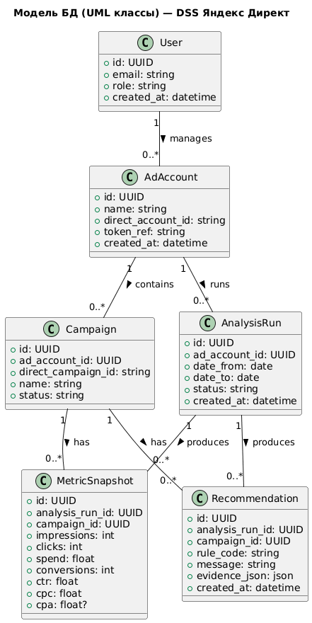

# Лабораторная работа №3
## Тема: Использование принципов проектирования на уровне методов и классов
### Цель работы
Получить опыт проектирования и реализации модулей с использованием принципов KISS, YAGNI, DRY, SOLID и др.

**Выбранный вариант использования:**  
Запустить анализ рекламных кампаний за выбранный период и получить список проблем и рекомендаций.

---

## Диаграмма контейнеров (C4)
На диаграмме показан общий набор контейнеров, где далее детализируется контейнер **Backend API**.



**Кратко:**
- Web UI обращается к Backend API по HTTPS.
- Backend API пишет/читает данные в PostgreSQL.
- Фоновая обработка выполняется Worker’ом, задачи передаются через очередь (Redis/RabbitMQ).
- Worker ходит во внешние API Яндекс Директ.

---

## Диаграмма компонентов (C4)
Ниже компоненты контейнера **Backend API**, для которых далее приводится код.



**Компоненты:**
- `CampaignStatsService` — получение статистики (через репозиторий / адаптер)
- `KpiCalculator` — расчет KPI
- `RulesEngine` — проверка правил
- `RecommendationService` — формирование рекомендаций
- `ReportController` — API для UI
- `Repositories` — слой доступа к БД

---

## Диаграмма последовательностей
Диаграмма показывает взаимодействие компонентов при запуске анализа кампаний и получении рекомендаций.



**Кратко:**
1) Пользователь запускает анализ (период)
2) Backend инициирует задачу в очередь
3) Worker загружает статистику, считает KPI, прогоняет правила
4) Результаты сохраняются в БД  
5) Пользователь получает готовый отчет через API

---

## Модель БД (UML диаграмма классов)
Сущности хранилища данных. Здесь показана логическая модель.



**Сущности:**
1) `User` — пользователи системы  
2) `AdAccount` — подключенные рекламные аккаунты  
3) `Campaign` — кампании Яндекс Директ (минимальные поля)  
4) `AnalysisRun` — запуск анализа (период, статус)  
5) `MetricSnapshot` — рассчитанные KPI (по кампании и запуску)  
6) `Recommendation` — рекомендации и причины (по кампании и запуску)  

---

## Применение основных принципов разработки
Ниже — фрагменты кода (сервер + простой клиент), с пояснениями как соблюдены KISS, YAGNI, DRY и SOLID.

### 1) Сервер (FastAPI): запуск анализа и получение отчета
**KISS:** 2 эндпоинта и простой формат DTO
**YAGNI:** без сложной авторизации и без real-time оптимизации ставок
**DRY:** вынесены повторяющиеся преобразования в функции/классы 
**SOLID:** сервисы разделены, зависимости передаются через интерфейсы

```python
# app/api.py
from fastapi import FastAPI, HTTPException
from pydantic import BaseModel
from typing import List, Optional
from uuid import uuid4

app = FastAPI()

# --- DTO (KISS) ---
class RunRequest(BaseModel):
    account_id: str
    date_from: str
    date_to: str

class RecommendationDto(BaseModel):
    campaign_id: str
    rule: str
    message: str
    evidence: dict

class RunResponse(BaseModel):
    run_id: str

# --- Абстракции ---
class StatsProvider:
    def fetch_campaign_stats(self, account_id: str, date_from: str, date_to: str) -> list:
        raise NotImplementedError

class Repository:
    def save_run(self, run_id: str, payload: dict) -> None:
        raise NotImplementedError
    def save_recommendations(self, run_id: str, recos: list) -> None:
        raise NotImplementedError
    def get_recommendations(self, run_id: str) -> list:
        raise NotImplementedError

# --- Реализации ---
class InMemoryRepo(Repository):
    def __init__(self):
        self.runs = {}
        self.recos = {}

    def save_run(self, run_id: str, payload: dict) -> None:
        self.runs[run_id] = payload

    def save_recommendations(self, run_id: str, recos: list) -> None:
        self.recos[run_id] = recos

    def get_recommendations(self, run_id: str) -> list:
        return self.recos.get(run_id, [])

class FakeStatsProvider(StatsProvider):
    # YAGNI: не подключаем реальный API, достаточно заглушки
    def fetch_campaign_stats(self, account_id: str, date_from: str, date_to: str) -> list:
        return [
            {"campaign_id": "c1", "impressions": 1000, "clicks": 10, "spend": 1200, "conversions": 0},
            {"campaign_id": "c2", "impressions": 5000, "clicks": 200, "spend": 8000, "conversions": 12},
        ]

# --- Бизнес-логика (SoC + SOLID: SRP) ---
class KpiCalculator:
    def calc(self, row: dict) -> dict:
        clicks = row["clicks"]
        imps = row["impressions"]
        spend = row["spend"]
        conv = row.get("conversions", 0)

        ctr = (clicks / imps) if imps else 0
        cpc = (spend / clicks) if clicks else 0
        cpa = (spend / conv) if conv else None
        return {"ctr": ctr, "cpc": cpc, "cpa": cpa}

class RulesEngine:
    # DRY: правила — в одном месте, легко расширять
    def check(self, stats: dict, kpi: dict) -> List[dict]:
        issues = []
        if stats["spend"] > 1000 and stats.get("conversions", 0) == 0:
            issues.append({
                "rule": "SPEND_WITHOUT_CONVERSIONS",
                "message": "Высокий расход при нулевых конверсиях — проверить ключевые фразы/минус-слова/посадочную.",
                "evidence": {"spend": stats["spend"], "conversions": stats.get("conversions", 0)}
            })
        if kpi["ctr"] < 0.01:
            issues.append({
                "rule": "LOW_CTR",
                "message": "Низкий CTR — проверить релевантность объявлений и заголовков.",
                "evidence": {"ctr": kpi["ctr"]}
            })
        return issues

class RecommendationService:
    def __init__(self, provider: StatsProvider, repo: Repository):
        self.provider = provider
        self.repo = repo
        self.kpi_calc = KpiCalculator()
        self.rules = RulesEngine()

    def run_analysis(self, account_id: str, date_from: str, date_to: str) -> str:
        run_id = str(uuid4())
        self.repo.save_run(run_id, {"account_id": account_id, "date_from": date_from, "date_to": date_to})

        stats_rows = self.provider.fetch_campaign_stats(account_id, date_from, date_to)

        recos = []
        for row in stats_rows:
            kpi = self.kpi_calc.calc(row)
            issues = self.rules.check(row, kpi)
            for issue in issues:
                recos.append({
                    "campaign_id": row["campaign_id"],
                    "rule": issue["rule"],
                    "message": issue["message"],
                    "evidence": issue["evidence"],
                })

        self.repo.save_recommendations(run_id, recos)
        return run_id

    def get_report(self, run_id: str) -> list:
        return self.repo.get_recommendations(run_id)

# --- DI (SOLID: DIP) ---
repo = InMemoryRepo()
provider = FakeStatsProvider()
service = RecommendationService(provider, repo)

@app.post("/analysis/run", response_model=RunResponse)
def start_analysis(req: RunRequest):
    run_id = service.run_analysis(req.account_id, req.date_from, req.date_to)
    return RunResponse(run_id=run_id)

@app.get("/analysis/{run_id}/recommendations", response_model=List[RecommendationDto])
def get_recommendations(run_id: str):
    recos = service.get_report(run_id)
    if not recos:
        raise HTTPException(status_code=404, detail="Результаты не найдены (проверьте run_id).")
    return recos
```

**Пояснение принципов на этом примере:**

* **KISS:** два эндпоинта: “запуск” и “получить рекомендации”
* **YAGNI:** вместо реального Direct API — `FakeStatsProvider`
* **DRY:** правила в одном `RulesEngine`, расчет KPI в одном `KpiCalculator`
* **SOLID:**

  * **SRP:** классы отвечают за одну задачу (KPI, правила, сервис рекомендаций)
  * **DIP:** `RecommendationService` зависит от абстракций `StatsProvider` и `Repository`
  * **OCP (частично):** можно добавить новое правило, не переписывая остальное
  * **ISP/LSP:** реализации можно заменить без изменения сервиса

### 2) Минимальный клиентский код

**KISS:** запрос на запуск и получение рекомендаций

```python
# client/run_demo.py
import requests

BASE = "http://localhost:8000"

run = requests.post(f"{BASE}/analysis/run", json={
    "account_id": "demo-account",
    "date_from": "2026-03-01",
    "date_to": "2026-03-07"
}).json()

run_id = run["run_id"]
print("run_id:", run_id)

recos = requests.get(f"{BASE}/analysis/{run_id}/recommendations").json()
for r in recos:
    print(r["campaign_id"], r["rule"], "-", r["message"])
```

---

## Дополнительные принципы разработки

### BDUF

**Отказ от полного BDUF**.
В дипломе важно быстро получить работающий MVP. Полное проектирование всего наперед повышает риск потратить время на детали, которые не понадобятся. Вместо этого применяем умеренный подход: фиксируем ключевые решения (C4 + правила + сущности) и развиваем итеративно.

### SoC

**Применяется.**
Разделены уровни ответственности: API-контроллеры, бизнес-сервисы, правила/расчеты KPI, репозиторий, интеграции

### MVP

**Применяется.**
Система ограничена минимальным набором функций: загрузка статистики (заглушка), расчет KPI, правила, рекомендации, просмотр результата.

### PoC

**Применяется частично.**
Для демонстрации идеи можно начать с PoC: показать, что правила + KPI дают понятные рекомендации на тестовых данных. Затем PoC расширяется до MVP: добавляется хранение, интерфейс, интеграции.