# Лабораторная работа №4
## Тема: Проектирование REST API
### Цель работы
Получить опыт проектирования программного интерфейса.

---

## Документация по API

### Описание сервиса
В рамках лабораторной проектируется REST API сервиса **управления анализами и рекомендациями** для системы DSS оптимизации рекламных кампаний в Яндекс Директ.

**Базовый URL:** `http://localhost:8000`  
**Формат данных:** JSON  
**Авторизация:** заголовок `X-API-Key: demo`

---

## Принятые проектные решения

1. **Ресурсный стиль URL**  
   Используются сущности (resources) во множественном числе: `/accounts`, `/analysis-runs`, `/rules`.

2. **Версионирование API**  
   Для MVP добавлен префикс `/api/v1`, чтобы в будущем менять контракт без поломок клиентов.

3. **Единый формат ошибок**  
   Ошибки возвращаются в виде JSON: `{ "error": { "code": "...", "message": "..." } }`.

4. **Идентификаторы как строки UUID**  
   Все ресурсы используют `id` в формате строкового UUID для унификации.

5. **Четкие HTTP статусы**  
   - `200 OK` — успешный запрос  
   - `201 Created` — создан ресурс  
   - `400 Bad Request` — ошибка валидации/логики  
   - `401 Unauthorized` — нет ключа доступа  
   - `404 Not Found` — ресурс не найден

6. **Идемпотентность PUT**  
   `PUT /rules/{rule_id}` полностью заменяет объект правила.

7. **DELETE возвращает 204**  
   При успешном удалении возвращается `204 No Content`, без тела ответа.

8. **Минимальный набор полей (YAGNI)**  
   В сущностях оставлены только поля, необходимые для MVP.

9. **Разделение ответственности по ресурсам**  
   Запуски анализов (`analysis-runs`) отделены от правил (`rules`), чтобы контракт был яснее.

---

## Endpoints

> Для каждого endpoint указаны: метод, URL, запрос/ответ и пример.

### 1) Health Check
**Метод:** GET  
**URL:** `/api/v1/health`

**Ответ 200:**
```json
{ "status": "ok" }
```

---

### 2) Создать рекламный аккаунт

**Метод:** POST
**URL:** `/api/v1/accounts`

**Body (JSON):**

```json
{
  "name": "Demo account",
  "direct_account_id": "12345"
}
```

**Ответ 201:**

```json
{
  "id": "uuid",
  "name": "Demo account",
  "direct_account_id": "12345"
}
```

---

### 3) Получить список аккаунтов

**Метод:** GET
**URL:** `/api/v1/accounts`

**Ответ 200:**

```json
[
  { "id": "uuid", "name": "Demo account", "direct_account_id": "12345" }
]
```

---

### 4) Запустить анализ

**Метод:** POST
**URL:** `/api/v1/analysis-runs`

**Body (JSON):**

```json
{
  "account_id": "uuid",
  "date_from": "2026-03-01",
  "date_to": "2026-03-07"
}
```

**Ответ 201:**

```json
{
  "run_id": "uuid",
  "status": "DONE"
}
```

---

### 5) Получить рекомендации по запуску анализа

**Метод:** GET
**URL:** `/api/v1/analysis-runs/{run_id}/recommendations`

**Ответ 200:**

```json
[
  {
    "campaign_id": "c1",
    "rule": "SPEND_WITHOUT_CONVERSIONS",
    "message": "Высокий расход при нулевых конверсиях — проверить ключевые фразы/минус-слова/посадочную.",
    "evidence": { "spend": 1200, "conversions": 0 }
  }
]
```

---

### 6) Получить список правил

**Метод:** GET
**URL:** `/api/v1/rules`

**Ответ 200:**

```json
[
  {
    "id": "uuid",
    "code": "LOW_CTR",
    "enabled": true,
    "threshold": 0.01
  }
]
```

---

### 7) Обновить правило 

**Метод:** PUT
**URL:** `/api/v1/rules/{rule_id}`

**Body (JSON):**

```json
{
  "enabled": false,
  "threshold": 0.02
}
```

**Ответ 200:**

```json
{
  "id": "uuid",
  "code": "LOW_CTR",
  "enabled": false,
  "threshold": 0.02
}
```

---

### 8) Удалить правило 

**Метод:** DELETE
**URL:** `/api/v1/rules/{rule_id}`

**Ответ 204:** (без тела)

---

# Тестирование API (Postman)

## Общие настройки для всех запросов

* Header: `X-API-Key: demo`

Ниже список тестов для каждого endpoint.

---

## Тесты

### Endpoint: GET /api/v1/health
 
**Тест 1 (успех):**

* Method: GET
* URL: `http://localhost:8000/api/v1/health`
* Ожидание: `200`, body содержит `"status": "ok"`

Скриншоты:

* Запрос (Params/Headers): 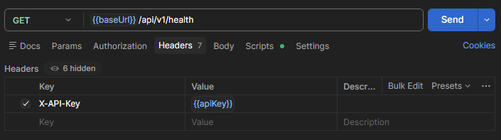
* Ответ (Body/Headers): 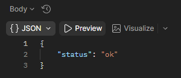
* Tests + Test Results: 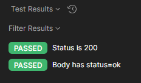

**Тест 2 (без ключа):**

* Убрать `X-API-Key`
* Ожидание: `401`

Скриншоты:

* 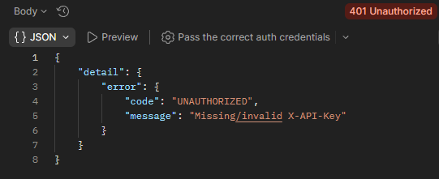

---

### Endpoint: POST /api/v1/accounts

**Тест 1 (создание):**

* POST `http://localhost:8000/api/v1/accounts`
* Body: `{ "name": "Demo account", "direct_account_id": "12345" }`
* Ожидание: `201`, в ответе есть `id`

Скриншоты:

* 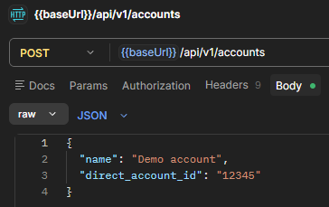
* 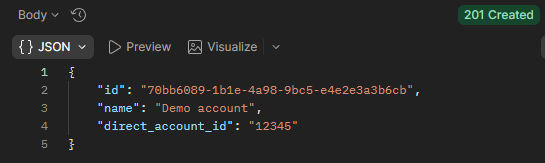
* 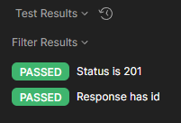

**Тест 2 (валидация):**

* Body без `direct_account_id`
* Ожидание: `400`

Скриншоты:

* 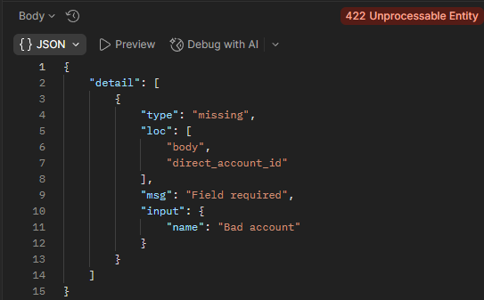

---

### Endpoint: GET /api/v1/accounts

**Тест 1 (успех):**

* GET `http://localhost:8000/api/v1/accounts`
* Ожидание: `200`, массив

Скриншоты:

* 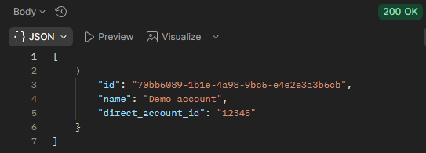

**Тест 2 (без ключа):**

* убрать `X-API-Key`
* Ожидание: `401`

Скриншоты:

* 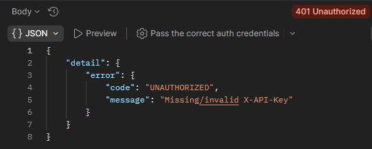

---

### Endpoint: POST /api/v1/analysis-runs

**Тест 1 (успех):**

* POST `http://localhost:8000/api/v1/analysis-runs`
* Body: `{ "account_id": "<uuid>", "date_from": "2026-03-01", "date_to": "2026-03-07" }`
* Ожидание: `201`, ответ содержит `run_id`

Скриншоты:

* 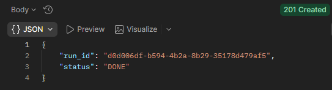

**Тест 2 (ошибка: аккаунт не найден):**

* account_id = "wrong"
* Ожидание: `404`

Скриншоты:

* 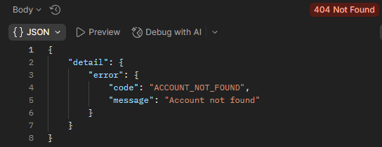

---

### Endpoint: GET /api/v1/analysis-runs/{run_id}/recommendations

**Тест 1 (успех):**

* GET `http://localhost:8000/api/v1/analysis-runs/<run_id>/recommendations`
* Ожидание: `200`, массив рекомендаций

Скриншоты:

* 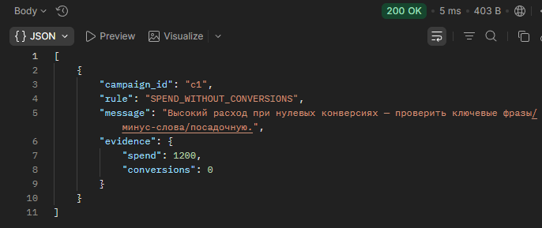

**Тест 2 (run_id не найден):**

* GET с несуществующим run_id
* Ожидание: `404`

Скриншоты:

* 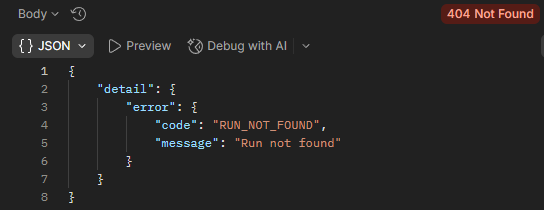

---

### Endpoint: GET /api/v1/rules

**Тест 1 (успех):**

* GET `http://localhost:8000/api/v1/rules`
* Ожидание: `200`

Скриншоты:

* 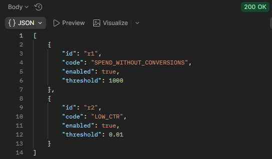

**Тест 2 (без ключа):**

* Ожидание: `401`

Скриншоты:

* 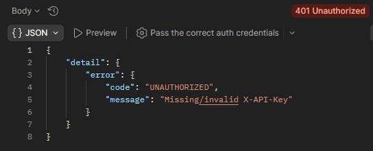

---

### Endpoint: PUT /api/v1/rules/{rule_id}

**Тест 1 (успех):**

* PUT `http://localhost:8000/api/v1/rules/<rule_id>`
* Body: `{ "enabled": false, "threshold": 0.02 }`
* Ожидание: `200`

Скриншоты:

* 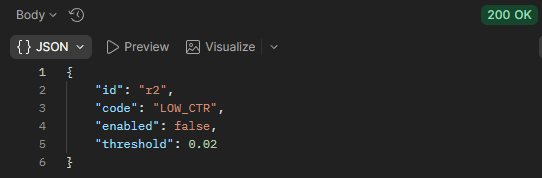

**Тест 2 (rule_id не найден):**

* PUT на неизвестный id
* Ожидание: `404`

Скриншоты:

* 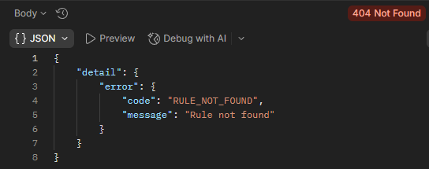

---

### Endpoint: DELETE /api/v1/rules/{rule_id}

**Тест 1 (успех):**

* DELETE `http://localhost:8000/api/v1/rules/<rule_id>`
* Ожидание: `204`

Скриншоты:

* 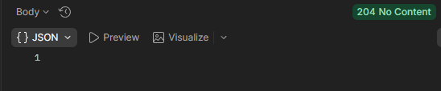

**Тест 2 (rule_id не найден):**

* DELETE на неизвестный id
* Ожидание: `404`

Скриншоты:

* 

---

## Примеры автотестов Postman

Для успешного запроса:

```js
pm.test("Status code is 200/201", function () {
  pm.expect([200, 201]).to.include(pm.response.code);
});

pm.test("Response is JSON", function () {
  pm.response.to.be.json;
});
```

Для ошибки:

```js
pm.test("Status code is 401/404/400", function () {
  pm.expect([400, 401, 404]).to.include(pm.response.code);
});
```

---

## 2) Реализация API: `lab4/app.py` (FastAPI)

> Пакеты: `pip install fastapi uvicorn` 
> Запуск: `uvicorn app:app --reload`

```python
from fastapi import FastAPI, Header, HTTPException
from pydantic import BaseModel
from typing import Optional, List, Dict, Any
from uuid import uuid4

app = FastAPI(title="Lab4 API", version="1.0")

# ---- simple auth ----
def require_key(x_api_key: Optional[str]):
    if x_api_key != "demo":
        raise HTTPException(status_code=401, detail={"error": {"code": "UNAUTHORIZED", "message": "Missing/invalid X-API-Key"}})

# ---- storage ----
ACCOUNTS: Dict[str, dict] = {}
RUNS: Dict[str, dict] = {}
RECOS: Dict[str, list] = {}

# preset rules
RULES: Dict[str, dict] = {
    "r1": {"id": "r1", "code": "SPEND_WITHOUT_CONVERSIONS", "enabled": True, "threshold": 1000},
    "r2": {"id": "r2", "code": "LOW_CTR", "enabled": True, "threshold": 0.01},
}

# ---- DTO ----
class AccountCreate(BaseModel):
    name: str
    direct_account_id: str

class RunCreate(BaseModel):
    account_id: str
    date_from: str
    date_to: str

class RuleUpdate(BaseModel):
    enabled: bool
    threshold: float

@app.get("/api/v1/health")
def health(x_api_key: Optional[str] = Header(default=None, alias="X-API-Key")):
    require_key(x_api_key)
    return {"status": "ok"}

@app.post("/api/v1/accounts", status_code=201)
def create_account(payload: AccountCreate, x_api_key: Optional[str] = Header(default=None, alias="X-API-Key")):
    require_key(x_api_key)
    acc_id = str(uuid4())
    ACCOUNTS[acc_id] = {"id": acc_id, "name": payload.name, "direct_account_id": payload.direct_account_id}
    return ACCOUNTS[acc_id]

@app.get("/api/v1/accounts")
def list_accounts(x_api_key: Optional[str] = Header(default=None, alias="X-API-Key")):
    require_key(x_api_key)
    return list(ACCOUNTS.values())

@app.post("/api/v1/analysis-runs", status_code=201)
def create_run(payload: RunCreate, x_api_key: Optional[str] = Header(default=None, alias="X-API-Key")):
    require_key(x_api_key)
    if payload.account_id not in ACCOUNTS:
        raise HTTPException(status_code=404, detail={"error": {"code": "ACCOUNT_NOT_FOUND", "message": "Account not found"}})

    run_id = str(uuid4())
    RUNS[run_id] = {"run_id": run_id, "status": "DONE", "account_id": payload.account_id, "date_from": payload.date_from, "date_to": payload.date_to}

    # Demo recommendations
    RECOS[run_id] = [
        {
            "campaign_id": "c1",
            "rule": "SPEND_WITHOUT_CONVERSIONS",
            "message": "Высокий расход при нулевых конверсиях — проверить ключевые фразы/минус-слова/посадочную.",
            "evidence": {"spend": 1200, "conversions": 0},
        }
    ]
    return {"run_id": run_id, "status": "DONE"}

@app.get("/api/v1/analysis-runs/{run_id}/recommendations")
def get_recommendations(run_id: str, x_api_key: Optional[str] = Header(default=None, alias="X-API-Key")):
    require_key(x_api_key)
    if run_id not in RECOS:
        raise HTTPException(status_code=404, detail={"error": {"code": "RUN_NOT_FOUND", "message": "Run not found"}})
    return RECOS[run_id]

@app.get("/api/v1/rules")
def list_rules(x_api_key: Optional[str] = Header(default=None, alias="X-API-Key")):
    require_key(x_api_key)
    return list(RULES.values())

# ---- advanced (PUT/DELETE) ----
@app.put("/api/v1/rules/{rule_id}")
def update_rule(rule_id: str, payload: RuleUpdate, x_api_key: Optional[str] = Header(default=None, alias="X-API-Key")):
    require_key(x_api_key)
    if rule_id not in RULES:
        raise HTTPException(status_code=404, detail={"error": {"code": "RULE_NOT_FOUND", "message": "Rule not found"}})
    RULES[rule_id]["enabled"] = payload.enabled
    RULES[rule_id]["threshold"] = payload.threshold
    return RULES[rule_id]

@app.delete("/api/v1/rules/{rule_id}", status_code=204)
def delete_rule(rule_id: str, x_api_key: Optional[str] = Header(default=None, alias="X-API-Key")):
    require_key(x_api_key)
    if rule_id not in RULES:
        raise HTTPException(status_code=404, detail={"error": {"code": "RULE_NOT_FOUND", "message": "Rule not found"}})
    del RULES[rule_id]
    return
```