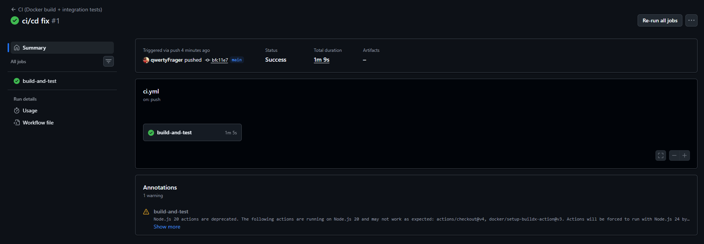

# Лабораторная работа №5
## Тема: Реализация архитектуры на основе сервисов (микросервисной архитектуры)
### Цель работы
Получить опыт организации взаимодействия сервисов с использованием контейнеров Docker.

---

## Реализованная архитектура

В рамках работы реализовано приложение, состоящее из трех взаимодействующих контейнеров:

1. **frontend** — клиентская часть, отображающая интерфейс системы и позволяющая вызывать API;
2. **backend** — серверная часть на FastAPI, реализующая REST API и бизнес-логику;
3. **db** — база данных PostgreSQL, используемая для хранения аккаунтов, запусков анализа, рекомендаций и правил.

Контейнеры запускаются с помощью `docker compose` и взаимодействуют друг с другом по внутренней сети Docker.

---

## Состав контейнеров

### 1. Frontend
Контейнер `frontend` построен на базе `nginx` и отдает статический пользовательский интерфейс.  
Через этот интерфейс можно:
- проверить состояние сервиса;
- создать рекламный аккаунт;
- получить список аккаунтов;
- запустить анализ;
- получить рекомендации;
- получить список правил.

### 2. Backend
Контейнер `backend` реализован на FastAPI и предоставляет REST API:
- `GET /api/v1/health`
- `POST /api/v1/accounts`
- `GET /api/v1/accounts`
- `POST /api/v1/analysis-runs`
- `GET /api/v1/analysis-runs/{run_id}/recommendations`
- `GET /api/v1/rules`
- `PUT /api/v1/rules/{rule_id}`
- `DELETE /api/v1/rules/{rule_id}`

### 3. Database
Контейнер `db` использует PostgreSQL и хранит:
- аккаунты,
- запуски анализа,
- рекомендации,
- правила.

---

## Файлы проекта

Структура папки `lab5`:

```text
lab5/
  README.md
  docker-compose.yml

  backend/
    Dockerfile
    requirements.txt
    app.py

  frontend/
    Dockerfile
    nginx.conf
    index.html

  tests/
    postman/
      collection.json

  .github/
    workflows/
      ci.yml
```

---

## Запуск проекта локально

### Требования

* установлен Docker Desktop;
* установлен Git.

### Команды запуска

```bash
cd lab5
docker compose up --build
```

После запуска сервисы будут доступны по адресам:

* **Frontend:** [http://localhost:8080](http://localhost:8080)
* **Backend API:** [http://localhost:8000](http://localhost:8000)
* **Swagger UI:** [http://localhost:8000/docs](http://localhost:8000/docs)

---

## Проверка работоспособности

### Проверка health endpoint

```bash
curl -H "X-API-Key: demo" http://localhost:8000/api/v1/health
```

Ожидаемый результат:

```json
{ "status": "ok" }
```

### Создание аккаунта

```bash
curl -H "X-API-Key: demo" -H "Content-Type: application/json" \
  -d '{"name":"Demo","direct_account_id":"12345"}' \
  http://localhost:8000/api/v1/accounts
```

### Получение списка аккаунтов

```bash
curl -H "X-API-Key: demo" http://localhost:8000/api/v1/accounts
```

### Запуск анализа

```bash
curl -H "X-API-Key: demo" -H "Content-Type: application/json" \
  -d '{"account_id":"<UUID>","date_from":"2026-03-01","date_to":"2026-03-07"}' \
  http://localhost:8000/api/v1/analysis-runs
```

### Получение рекомендаций

```bash
curl -H "X-API-Key: demo" \
  http://localhost:8000/api/v1/analysis-runs/<RUN_ID>/recommendations
```

---

## Непрерывная интеграция (CI)

В проекте настроен GitHub Actions workflow, который выполняет:

1. сборку Docker-образов frontend и backend;
2. запуск всех контейнеров через `docker compose`;
3. ожидание готовности backend;
4. запуск интеграционных тестов через Newman;
5. остановку контейнеров после завершения.

Файл workflow:

```text
.github/workflows/ci.yml
```

Скриншот успешного выполнения workflow:



---

## Интеграционные тесты

Интеграционные тесты реализованы в виде Postman-коллекции:

```text
lab5/tests/postman/collection.json
```

В коллекции тестируются основные сценарии:

* health check;
* создание аккаунта;
* получение списка аккаунтов;
* запуск анализа;
* получение рекомендаций;
* получение списка правил.

Тесты выполняются автоматически в CI с помощью Newman.

или

```bash
npm install -g newman
newman run tests/postman/collection.json
```

---

## Используемые технологии

* **Frontend:** HTML, CSS, JavaScript, Nginx
* **Backend:** Python, FastAPI, SQLAlchemy
* **Database:** PostgreSQL
* **Контейнеризация:** Docker, Docker Compose
* **CI:** GitHub Actions
* **API testing:** Postman, Newman

---

## Вывод

В ходе лабораторной работы была реализована сервисная архитектура, состоящая из трех контейнеров: клиентской части, серверной части и базы данных. Контейнеры были успешно связаны между собой и запущены через Docker Compose. Кроме того, был настроен процесс непрерывной интеграции с автоматической сборкой и запуском интеграционных тестов. Это позволило продемонстрировать работоспособность приложения как набора взаимодействующих сервисов.