# Лабораторная работа №6
## Тема: Использование шаблонов проектирования
### Цель работы
Получить опыт применения шаблонов проектирования при написании кода программной системы.

В рамках лабораторной работы шаблоны проектирования рассматриваются на примере системы поддержки принятия решений для оптимизации рекламных кампаний в Яндекс Директ.  
Система получает статистику, рассчитывает KPI, применяет правила анализа и формирует рекомендации для маркетолога.

---

# Шаблоны проектирования GoF

## Порождающие шаблоны

## 1. Factory Method

**Общее назначение:**  
Определяет интерфейс для создания объектов, позволяя подклассам решать, какой класс создавать.

**Назначение в проекте:**  
Используется для создания разных типов правил анализа по их коду (`LOW_CTR`, `HIGH_SPEND_NO_CONVERSIONS` и т.д.).

### UML-диаграмма
```mermaid
classDiagram
    class RuleFactory {
      +create_rule(code)
    }

    class BaseRule {
      <<abstract>>
      +check(stats, kpi)
    }

    class LowCtrRule {
      +check(stats, kpi)
    }

    class HighSpendNoConversionsRule {
      +check(stats, kpi)
    }

    RuleFactory --> BaseRule
    BaseRule <|-- LowCtrRule
    BaseRule <|-- HighSpendNoConversionsRule
````

### Код

```python
from abc import ABC, abstractmethod

class BaseRule(ABC):
    @abstractmethod
    def check(self, stats, kpi):
        pass

class LowCtrRule(BaseRule):
    def check(self, stats, kpi):
        if kpi["ctr"] < 0.01:
            return {"rule": "LOW_CTR", "message": "Низкий CTR"}
        return None

class HighSpendNoConversionsRule(BaseRule):
    def check(self, stats, kpi):
        if stats["spend"] > 1000 and stats["conversions"] == 0:
            return {"rule": "HIGH_SPEND_NO_CONVERSIONS", "message": "Высокий расход без конверсий"}
        return None

class RuleFactory:
    def create_rule(self, code: str) -> BaseRule:
        if code == "LOW_CTR":
            return LowCtrRule()
        if code == "HIGH_SPEND_NO_CONVERSIONS":
            return HighSpendNoConversionsRule()
        raise ValueError("Unknown rule code")
```

---

## 2. Builder

**Общее назначение:**
Позволяет поэтапно конструировать сложный объект.

**Назначение в проекте:**
Используется для построения объекта рекомендации, где есть rule, message, evidence и campaign_id.

### UML-диаграмма

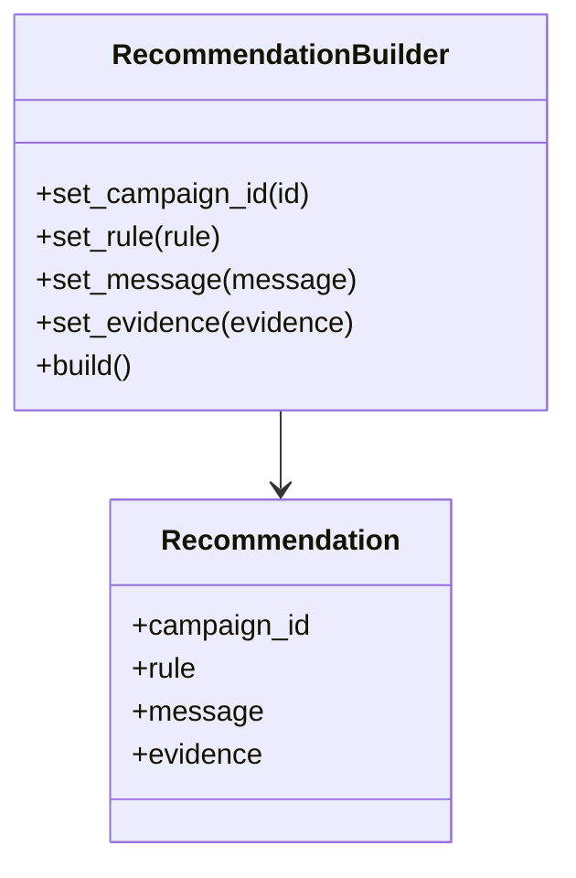

### Код

```python
class Recommendation:
    def __init__(self, campaign_id=None, rule=None, message=None, evidence=None):
        self.campaign_id = campaign_id
        self.rule = rule
        self.message = message
        self.evidence = evidence or {}

class RecommendationBuilder:
    def __init__(self):
        self.obj = Recommendation()

    def set_campaign_id(self, campaign_id):
        self.obj.campaign_id = campaign_id
        return self

    def set_rule(self, rule):
        self.obj.rule = rule
        return self

    def set_message(self, message):
        self.obj.message = message
        return self

    def set_evidence(self, evidence):
        self.obj.evidence = evidence
        return self

    def build(self):
        return self.obj
```

---

## 3. Singleton

**Общее назначение:**
Гарантирует, что у класса существует только один экземпляр.

**Назначение в проекте:**
Используется для хранения конфигурации приложения.

### UML-диаграмма

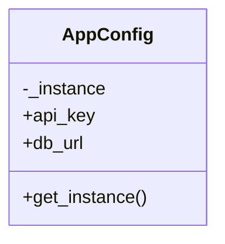

### Код

```python
class AppConfig:
    _instance = None

    def __init__(self, api_key="demo", db_url="postgresql://..."):
        self.api_key = api_key
        self.db_url = db_url

    @classmethod
    def get_instance(cls):
        if cls._instance is None:
            cls._instance = cls()
        return cls._instance
```

---

## Структурные шаблоны

## 4. Adapter

**Общее назначение:**
Преобразует интерфейс одного класса в интерфейс, ожидаемый клиентом.

**Назначение в проекте:**
Позволяет привести Yandex Direct API и другие внешние источники к единому методу `fetch_stats()`.

### UML-диаграмма

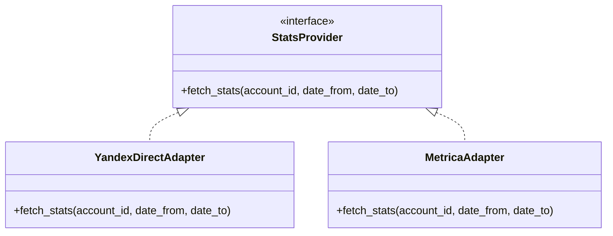

### Код

```python
class StatsProvider:
    def fetch_stats(self, account_id, date_from, date_to):
        raise NotImplementedError

class YandexDirectAdapter(StatsProvider):
    def fetch_stats(self, account_id, date_from, date_to):
        return [{"campaign_id": "c1", "impressions": 1000, "clicks": 10, "spend": 1200, "conversions": 0}]
```

---

## 5. Facade

**Общее назначение:**
Предоставляет упрощенный интерфейс к сложной подсистеме.

**Назначение в проекте:**
Фасад объединяет получение статистики, расчет KPI, проверку правил и формирование рекомендаций.

### UML-диаграмма

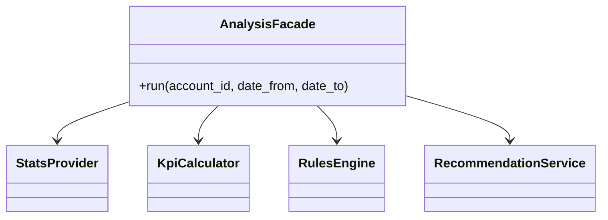

### Код

```python
class AnalysisFacade:
    def __init__(self, provider, kpi_calc, rules_engine, reco_service):
        self.provider = provider
        self.kpi_calc = kpi_calc
        self.rules_engine = rules_engine
        self.reco_service = reco_service

    def run(self, account_id, date_from, date_to):
        stats_rows = self.provider.fetch_stats(account_id, date_from, date_to)
        result = []
        for row in stats_rows:
            kpi = self.kpi_calc.calc(row)
            issues = self.rules_engine.check_all(row, kpi)
            result.extend(self.reco_service.make_recommendations(row, issues))
        return result
```

---

## 6. Decorator

**Общее назначение:**
Динамически добавляет объекту новую функциональность.

**Назначение в проекте:**
Используется для логирования запросов к поставщику статистики.

### UML-диаграмма

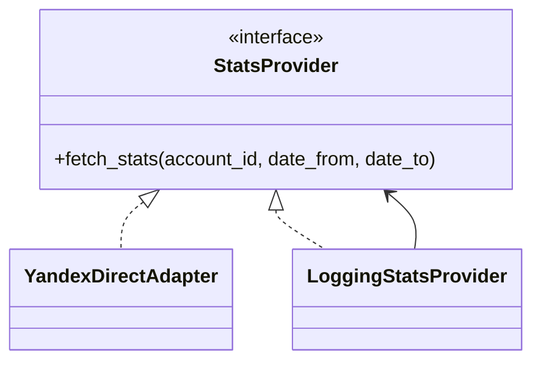

### Код

```python
class LoggingStatsProvider(StatsProvider):
    def __init__(self, wrapped):
        self.wrapped = wrapped

    def fetch_stats(self, account_id, date_from, date_to):
        print(f"[LOG] fetch_stats for account={account_id}")
        return self.wrapped.fetch_stats(account_id, date_from, date_to)
```

---

## 7. Proxy

**Общее назначение:**
Предоставляет объект-заместитель, который контролирует доступ к другому объекту.

**Назначение в проекте:**
Используется для кэширования статистики, чтобы не обращаться к внешнему API повторно.

### UML-диаграмма

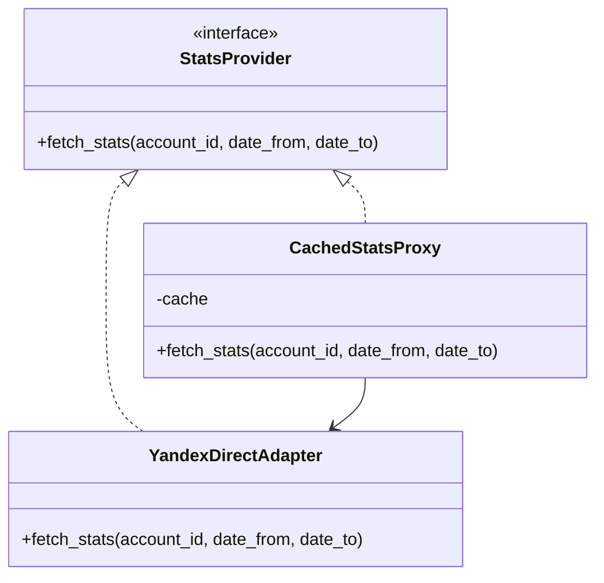

### Код

```python
class CachedStatsProxy(StatsProvider):
    def __init__(self, wrapped):
        self.wrapped = wrapped
        self.cache = {}

    def fetch_stats(self, account_id, date_from, date_to):
        key = (account_id, date_from, date_to)
        if key not in self.cache:
            self.cache[key] = self.wrapped.fetch_stats(account_id, date_from, date_to)
        return self.cache[key]
```

---

## Поведенческие шаблоны

## 8. Strategy

**Общее назначение:**
Позволяет определять семейство алгоритмов и делать их взаимозаменяемыми.

**Назначение в проекте:**
Используется для выбора стратегии расчета KPI или стратегии анализа.

### UML-диаграмма

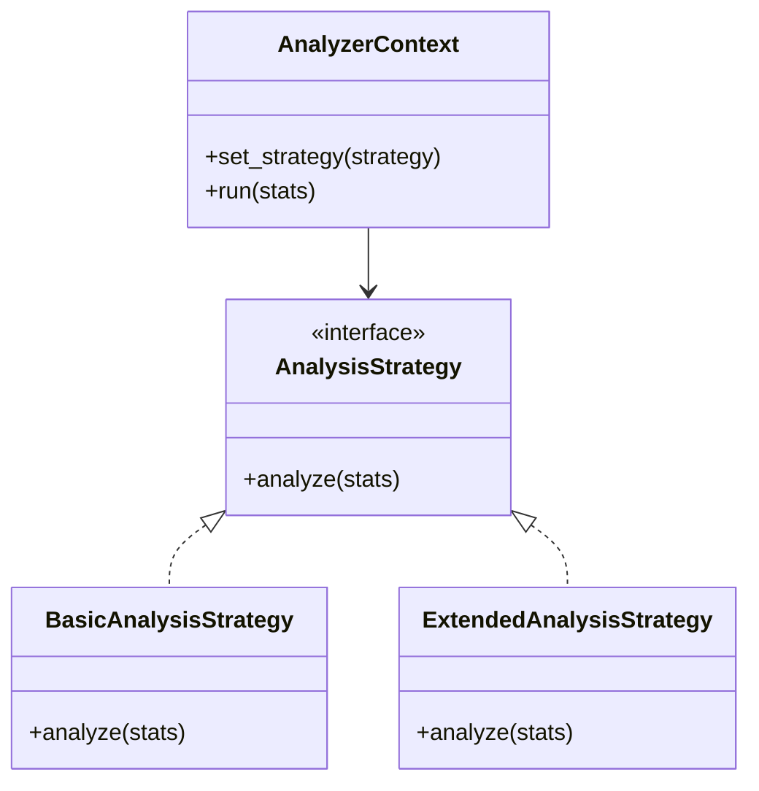

### Код

```python
class AnalysisStrategy:
    def analyze(self, stats):
        raise NotImplementedError

class BasicAnalysisStrategy(AnalysisStrategy):
    def analyze(self, stats):
        return {"mode": "basic", "count": len(stats)}

class ExtendedAnalysisStrategy(AnalysisStrategy):
    def analyze(self, stats):
        total_spend = sum(row["spend"] for row in stats)
        return {"mode": "extended", "total_spend": total_spend}

class AnalyzerContext:
    def __init__(self, strategy):
        self.strategy = strategy

    def set_strategy(self, strategy):
        self.strategy = strategy

    def run(self, stats):
        return self.strategy.analyze(stats)
```

---

## 9. Observer

**Общее назначение:**
Определяет зависимость «один ко многим», чтобы при изменении состояния объекта все подписчики получали уведомление.

**Назначение в проекте:**
Используется для уведомления подсистемы логирования или нотификаций о завершении анализа.

### UML-диаграмма

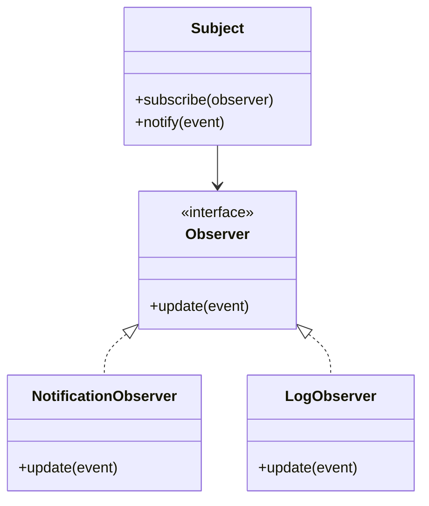

### Код

```python
class Observer:
    def update(self, event):
        raise NotImplementedError

class LogObserver(Observer):
    def update(self, event):
        print("[LOG]", event)

class NotificationObserver(Observer):
    def update(self, event):
        print("[NOTIFY]", event)

class AnalysisSubject:
    def __init__(self):
        self.observers = []

    def subscribe(self, observer):
        self.observers.append(observer)

    def notify(self, event):
        for obs in self.observers:
            obs.update(event)
```

---

## 10. Command

**Общее назначение:**
Инкапсулирует запрос как объект.

**Назначение в проекте:**
Используется для постановки задачи анализа в очередь.

### UML-диаграмма

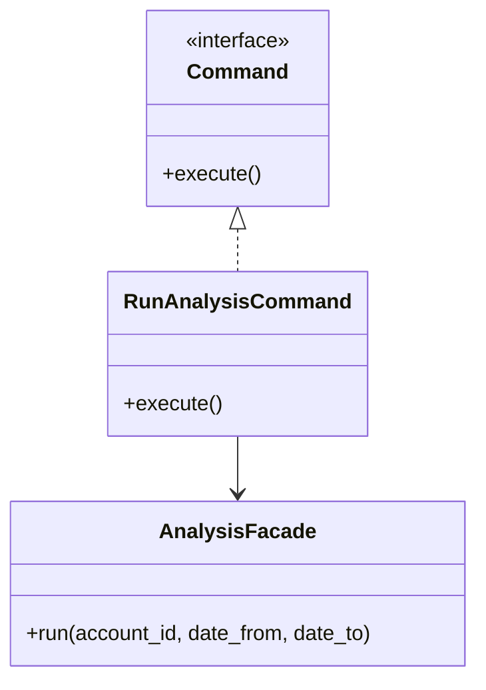

### Код

```python
class Command:
    def execute(self):
        raise NotImplementedError

class RunAnalysisCommand(Command):
    def __init__(self, facade, account_id, date_from, date_to):
        self.facade = facade
        self.account_id = account_id
        self.date_from = date_from
        self.date_to = date_to

    def execute(self):
        return self.facade.run(self.account_id, self.date_from, self.date_to)
```

---

## 11. Chain of Responsibility

**Общее назначение:**
Позволяет передавать запрос по цепочке обработчиков, пока один из них не обработает его.

**Назначение в проекте:**
Используется для последовательного применения правил анализа.

### UML-диаграмма

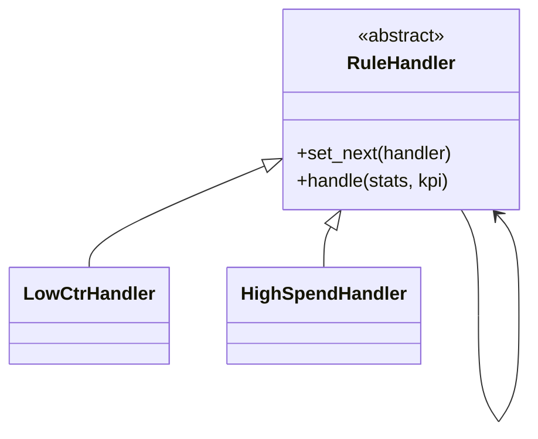

### Код

```python
class RuleHandler:
    def __init__(self):
        self.next_handler = None

    def set_next(self, handler):
        self.next_handler = handler
        return handler

    def handle(self, stats, kpi):
        result = self.check(stats, kpi)
        if result:
            return [result]
        if self.next_handler:
            return self.next_handler.handle(stats, kpi)
        return []

    def check(self, stats, kpi):
        raise NotImplementedError

class LowCtrHandler(RuleHandler):
    def check(self, stats, kpi):
        if kpi["ctr"] < 0.01:
            return {"rule": "LOW_CTR", "message": "Низкий CTR"}

class HighSpendHandler(RuleHandler):
    def check(self, stats, kpi):
        if stats["spend"] > 1000 and stats["conversions"] == 0:
            return {"rule": "HIGH_SPEND_NO_CONVERSIONS", "message": "Высокий расход без конверсий"}
```

---

## 12. Template Method

**Общее назначение:**
Определяет скелет алгоритма, оставляя реализацию некоторых шагов подклассам.

**Назначение в проекте:**
Используется для общего алгоритма анализа данных.

### UML-диаграмма

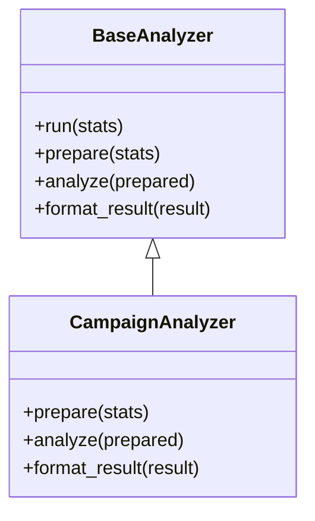

### Код

```python
class BaseAnalyzer:
    def run(self, stats):
        prepared = self.prepare(stats)
        result = self.analyze(prepared)
        return self.format_result(result)

    def prepare(self, stats):
        raise NotImplementedError

    def analyze(self, prepared):
        raise NotImplementedError

    def format_result(self, result):
        raise NotImplementedError

class CampaignAnalyzer(BaseAnalyzer):
    def prepare(self, stats):
        return stats

    def analyze(self, prepared):
        return {"campaigns_count": len(prepared)}

    def format_result(self, result):
        return {"status": "ok", "data": result}
```

---

# Шаблоны проектирования GRASP

## Роли (обязанности) классов

## 1. Information Expert

**Проблема:**
Кто должен рассчитывать CTR, CPC, CPA?

**Решение:**
Расчет выполняет `KpiCalculator`, потому что именно он владеет знаниями о формулах KPI.

**Код**

```python
class KpiCalculator:
    def calc(self, row):
        ctr = row["clicks"] / row["impressions"] if row["impressions"] else 0
        cpc = row["spend"] / row["clicks"] if row["clicks"] else 0
        cpa = row["spend"] / row["conversions"] if row["conversions"] else None
        return {"ctr": ctr, "cpc": cpc, "cpa": cpa}
```

**Результат:**
Повышается связность логики расчета и снижается дублирование.

**Связь с другими паттернами:**
SRP, Facade.

---

## 2. Creator

**Проблема:**
Кто должен создавать объекты рекомендаций?

**Решение:**
`RecommendationBuilder` и `RecommendationService` создают рекомендации, так как они непосредственно работают с их данными.

**Код**

```python
class RecommendationService:
    def make_recommendations(self, row, issues):
        result = []
        for issue in issues:
            reco = RecommendationBuilder() \
                .set_campaign_id(row["campaign_id"]) \
                .set_rule(issue["rule"]) \
                .set_message(issue["message"]) \
                .set_evidence(issue.get("evidence", {})) \
                .build()
            result.append(reco)
        return result
```

**Результат:**
Создание объектов сосредоточено в одном месте.

**Связь:**
Builder, Factory Method.

---

## 3. Controller

**Проблема:**
Какой объект должен принимать внешний запрос пользователя?

**Решение:**
`ReportController` или API endpoint выступает контроллером и передает выполнение фасаду/сервисам.

**Код**

```python
@app.post("/api/v1/analysis-runs")
def create_run(payload: RunCreate):
    return analysis_facade.run(payload.account_id, payload.date_from, payload.date_to)
```

**Результат:**
Интерфейс отделен от бизнес-логики.

**Связь:**
Facade, SoC.

---

## 4. Pure Fabrication

**Проблема:**
Где разместить техническую логику, которая не относится напрямую к сущностям?

**Решение:**
Создаются специальные сервисы (`RecommendationService`, `RulesEngine`, `AccountRepository`).

**Код**

```python
class RulesEngine:
    def check_all(self, row, kpi):
        pass
```

**Результат:**
Сущности не перегружены лишней логикой.

**Связь:**
Low Coupling, High Cohesion.

---

## 5. Indirection

**Проблема:**
Как уменьшить связанность между API и внешними источниками данных?

**Решение:**
Вводится промежуточный слой `StatsProvider` / `Adapter`.

**Код**

```python
class StatsProvider:
    def fetch_stats(self, account_id, date_from, date_to):
        raise NotImplementedError
```

**Результат:**
Можно заменить источник данных без изменения основного кода.

**Связь:**
Adapter, Protected Variations.

---

## Принципы разработки

## 1. Low Coupling

**Проблема:**
Если классы слишком зависят друг от друга, систему трудно изменять.

**Решение:**
Используются интерфейсы и сервисы с четкими ролями.

**Код**

```python
class RecommendationService:
    def __init__(self, provider, rules_engine):
        self.provider = provider
        self.rules_engine = rules_engine
```

**Результат:**
Классы легче тестировать и заменять.

**Связь:**
DIP, Adapter, Proxy.

---

## 2. High Cohesion

**Проблема:**
Если класс делает слишком много, его трудно поддерживать.

**Решение:**
Каждый класс решает одну основную задачу:

* `KpiCalculator` считает KPI,
* `RulesEngine` применяет правила,
* `RecommendationService` формирует рекомендации.

**Результат:**
Код проще читать и защищать.

**Связь:**
SRP, Facade.

---

## 3. Protected Variations

**Проблема:**
Как защитить систему от изменений внешнего API или логики правил?

**Решение:**
Изменяемые части скрываются за абстракциями (`StatsProvider`, `BaseRule`, `AnalysisStrategy`).

**Код**

```python
class StatsProvider:
    def fetch_stats(self, account_id, date_from, date_to):
        raise NotImplementedError
```

**Результат:**
Изменения меньше влияют на остальной код.

**Связь:**
Strategy, Adapter, Factory Method.

---

## Свойство программы (цель)

## Maintainability / Сопровождаемость

**Проблема:**
Система должна легко поддерживаться и расширяться: добавление новых правил, источников данных, стратегий анализа.

**Решение:**
Сочетание шаблонов Factory Method, Strategy, Adapter, Facade, Chain of Responsibility и GRASP-принципов Low Coupling / High Cohesion.

**Код**

```python
factory = RuleFactory()
rule = factory.create_rule("LOW_CTR")
```

**Результат:**
Новые функции можно добавлять без полного переписывания существующего кода.

**Связь:**
Protected Variations, OCP, SoC.

---

# Вывод

В ходе лабораторной работы были рассмотрены и адаптированы к проекту 12 шаблонов GoF:

* **Порождающие:** Factory Method, Builder, Singleton
* **Структурные:** Adapter, Facade, Decorator, Proxy
* **Поведенческие:** Strategy, Observer, Command, Chain of Responsibility, Template Method

Кроме того, был проведен анализ проектных решений с точки зрения GRASP.
Выбранные шаблоны позволяют сделать систему более понятной, модульной, расширяемой и удобной в сопровождении.

Для данного проекта особенно полезными оказались:
 
* **Factory Method** — для создания правил,
* **Facade** — для запуска полного цикла анализа,
* **Adapter** — для работы с внешними API,
* **Strategy** — для смены алгоритмов анализа,
* **Chain of Responsibility** — для применения правил,
* **Low Coupling / High Cohesion** — для общей структуры кода.